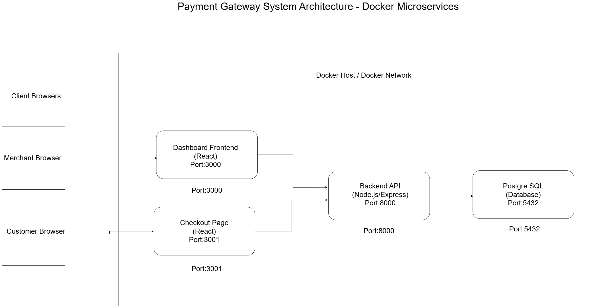

# Payment Gateway Project

A robust, Dockerized payment gateway simulation that supports Merchant Onboarding, Order Management, and Multi-Method Payment Processing (UPI & Cards). This project demonstrates a microservices-style architecture using Node.js, React, and PostgreSQL.

## 🚀 Features
* **Hosted Checkout Page:** Secure, user-friendly payment interface.
* **Payment Processing:** Supports UPI (VPA validation) and Credit Cards (Luhn Algorithm & Network Detection).
* **Merchant Dashboard:** Real-time analytics, transaction history, and API credential management.
* **RESTful API:** Secure endpoints for creating orders and processing payments.
* **Dockerized Deployment:** Complete environment setup with a single command.

## 🏗️ Architecture Overview
This system is composed of four Docker containers communicating via a private network:



* **Frontend (Dashboard - Port 3000):** React-based interface for merchants to track sales.
* **Frontend (Checkout - Port 3001):** Public-facing React page for customers to complete payments.
* **Backend API (Port 8000):** Node.js/Express server handling validation, auth, and logic.
* **Database (Port 5432):** PostgreSQL storing Merchants, Orders, and Payment records.

## 🛠️ Setup & Installation

### Prerequisites
* Docker & Docker Compose installed on your machine.

### Step-by-Step Guide
1.  **Clone the Repository:**
    ```bash
    git clone <your-repo-url>
    cd payment-gateway
    ```

2.  **Environment Configuration:**
    Create a `.env` file in the root directory by copying the example:
    ```bash
    cp .env.example .env
    ```
    *Ensure `DATABASE_URL` and `PORT` variables are set correctly in `.env`.*

3.  **Start the Application:**
    Run the following command to build and start all services:
    ```bash
    docker-compose up -d --build
    ```

4.  **Verify Installation:**
    * **Dashboard:** [http://localhost:3000](http://localhost:3000)
    * **Checkout Page:** (Requires an active Order ID)
    * **API Health Check:** [http://localhost:8000/health](http://localhost:8000/health)

## 🧪 Testing the System

### Default Test Merchant
The system automatically seeds a test merchant on startup:
* **Email:** `test@example.com`
* **API Key:** `key_test_abc123`
* **API Secret:** `secret_test_xyz789`

### How to Run a Test Payment
1.  **Login to Dashboard:** Go to `http://localhost:3000/login` and use the email `test@example.com` (any password works).
2.  **Generate an Order:** Use Postman or a curl command to create an order (see [API Documentation](./docs/API.md)).
3.  **Complete Payment:** Use the `order_id` from the response to visit `http://localhost:3001/checkout?order_id=...`.
4.  **Simulate Success/Failure:**
    * **UPI:** Use `test@upi` (Success) or invalid format (Fail).
    * **Card:** Use `4242424242424242` (Success) or `4242424242424241` (Fail/Luhn Error).

## 📄 Documentation
* [API Documentation](./docs/API.md) - Detailed endpoints and examples.
* [Database Schema](./docs/SCHEMA.md) - Tables, fields, and relationships.

## 🎥 Video Demo
Watch the complete end-to-end payment flow (Order Creation -> Checkout -> Success -> Dashboard Verification):

[**▶️ Click Here to Watch the Demo Video**](https://youtu.be/lU1Y4i80SPE)

---